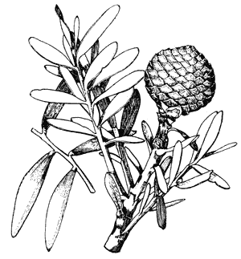

<p align="center">
  
  <br>
  <h1>Kauri</h1>
</p>

A single-header memory safety library for C99. 530 lines of arena allocator, string builder, and debug instrumentation, because I got tired of writing the same bump allocator in every project and getting it slightly wrong each time.

Named for the kauri tree: grows slowly, lives millennia, doesn't fall over. Unlike your heap allocator.

## What It Does

You give it a buffer. It bumps a pointer forward. When you're done, you reset. No individual frees, no lifetime tracking, no leak paths. The entire class of "forgot to free on the error path" bugs simply stops existing.

```c
#define KAURI_IMPL
#include "kauri.h"

uint8_t buf[4096];
ka_arena_t A;
ka_init(&A, buf, sizeof(buf), 0);

int *x = KA_NEW(&A, int);         /* typed alloc, aligned */
int *arr = KA_NEWN(&A, int, 100); /* array alloc, overflow-safe */
char *s = ka_sdup(&A, "hello", 0);/* string duplicate */

ka_mark_t m = ka_mark(&A);        /* save point */
/* ... temporary work ... */
ka_rwind(&A, m);                  /* rewind, temps gone */

ka_rst(&A);                       /* reset everything */
```

If you need more memory than the buffer has, pass `KA_CHAIN` and it'll overflow into `malloc`'d blocks. If you don't pass `KA_CHAIN`, it returns NULL when full. No surprises.

## Building

There's nothing to build. It's a header. Drop `kauri.h` into your project. In exactly one `.c` file:

```c
#define KAURI_IMPL
#include "kauri.h"
```

To run the tests:

```
make test    # 34 tests, zero warnings under -Werror -Wall -Wextra
```

Requires GCC. The Makefile is 15 lines.

## API

### Arena

| Function | What |
|----------|------|
| `ka_init(A, buf, cap, flags)` | Init arena. `buf=NULL` for heap-backed. |
| `ka_alloc(A, size, align)` | Bump-allocate. Returns NULL if full. |
| `ka_rst(A)` | Reset to empty. Free chain blocks. |
| `ka_free(A)` | Free everything including heap backing. |
| `ka_used(A)` / `ka_cap(A)` | Bytes used / total capacity. |
| `ka_mark(A)` / `ka_rwind(A, m)` | Save/restore point. |
| `ka_dup(A, src, size, align)` | Allocate and copy. |
| `ka_sdup(A, str, len)` | String duplicate. `len=0` to auto-measure. |
| `ka_peak(A)` | High-water alloc count (debug only). |

### Macros

| Macro | What |
|-------|------|
| `KA_NEW(A, T)` | Typed alloc: `(T *)ka_alloc(A, sizeof(T), alignof(T))` |
| `KA_NEWN(A, T, n)` | Array alloc with overflow-safe multiply |
| `KA_CHK(i, max)` | Bounds check. Returns 1 if OOB, 0 if fine. |
| `KA_PNEW(cnt, max)` | Pool index allocator. 0 = sentinel/full. |
| `KA_GUARD(g, max)` | Bounded loop counter. |

### String Builder

```c
char buf[256];
ka_str_t S;
ka_sinit(&S, buf, sizeof(buf));
ka_scat(&S, "hello ", 6);
ka_sfmt(&S, "world %d", 42);   /* printf-style */
ka_schr(&S, '!');
/* S.ptr = "hello world 42!", always NUL-terminated, never overflows */
```

### Error Codes

`ka_res_t` is a result type with `{code, msg}` (plus `{file, line}` in debug). Use `KA_TRY(expr)` for early return on error. Comes with `KA_OK`, `KA_OOB`, `KA_OOM`, `KA_OVFL`, `KA_INVAL`.

## Debug Mode

Compile with `-DKAURI_DEBUG=1` and the library grows teeth:

- **Canary bytes**: every allocation gets `0xDEADCA75` ("dead cats") written past its end. On reset/rewind, all canaries are checked. Buffer overrun? You'll hear about it.
- **Poison on free**: freed memory is `memset` to `0xDE`. Use-after-free shows up as garbage instead of stale-but-plausible data.
- **Peak tracking**: `ka_peak(A)` tells you the most allocations your arena has held across resets, so you can right-size your buffers instead of guessing.
- **Overflow-safe multiply**: `KA_NEWN(&A, huge_struct, huge_n)` returns NULL instead of silently allocating a wrapped-around 12-byte buffer for 4 billion structs.
- **Source locations**: `ka_res_t` includes `file` and `line`. OOB checks print exactly where.

Zero overhead in release builds. All of it is `#if KAURI_DEBUG`.

## On Rust

I like Rust. It's a genuinely good language with a genuinely good type system and if you're starting a new project from scratch with a team that knows it, you should probably use it.

But I write C99 (Nasty habit I picked up after reading old NASA code all day). Pre-allocated buffers, bounded loops, no recursion, fixed pools. The allocation patterns are simple: bump forward, reset when done. I don't need the compiler to track every lifetime through every borrow across every async boundary. I need a bump allocator that doesn't have bugs in it.

Every time I started a new C project I'd write the same arena, the same bounds-check macro, the same string builder, and introduce the same subtle off-by-one in the alignment code. Kauri is that code, written once, tested properly, with debug instrumentation that catches the mistakes I still make because I'm human and C doesn't care.

It's not a Rust replacement. It's a "stop repeating yourself" replacement.

## License

MIT. Do what you want with it. If it saves you a `use-after-free`, I'll consider that payment enough.

---

<p align="center">
  
  <br>
  <em>Rangitoto drawing by Lola Hambly</em>
</p>
